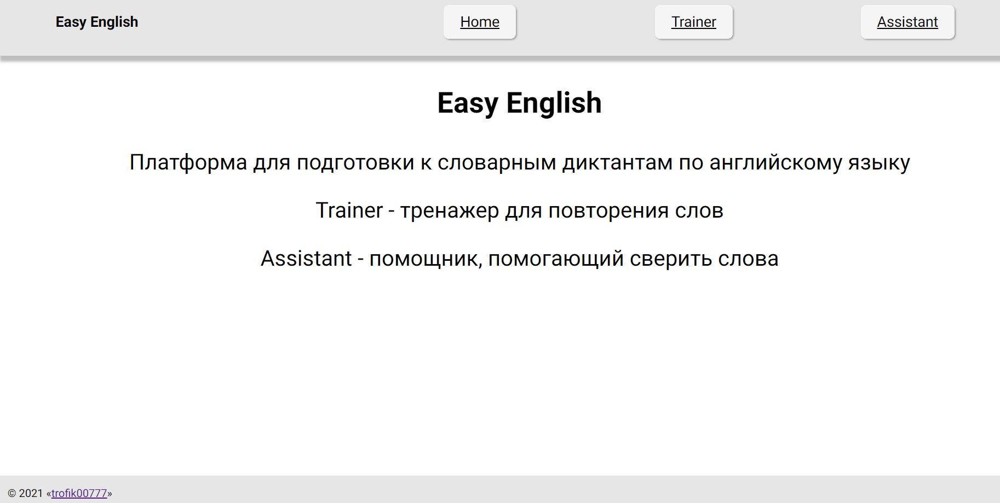
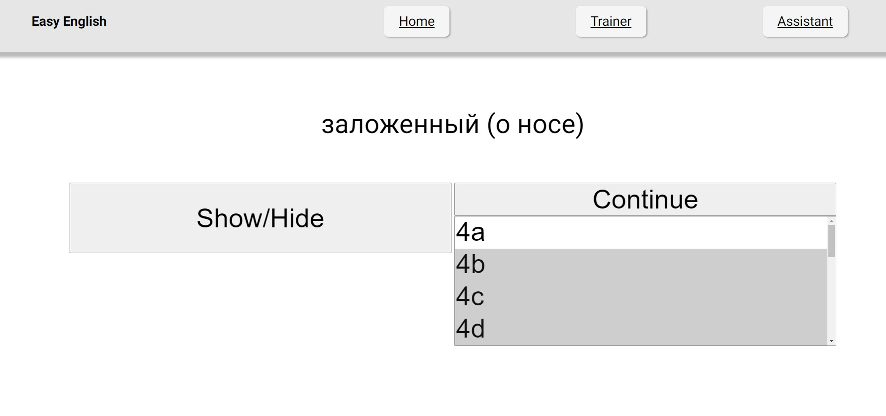
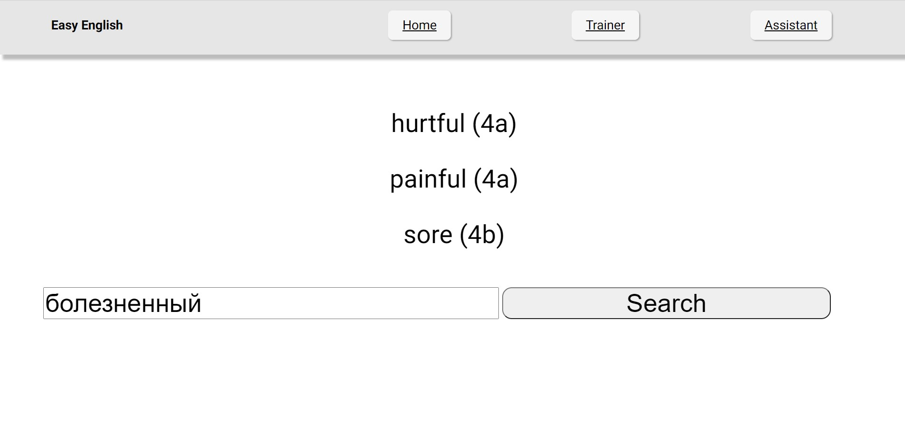
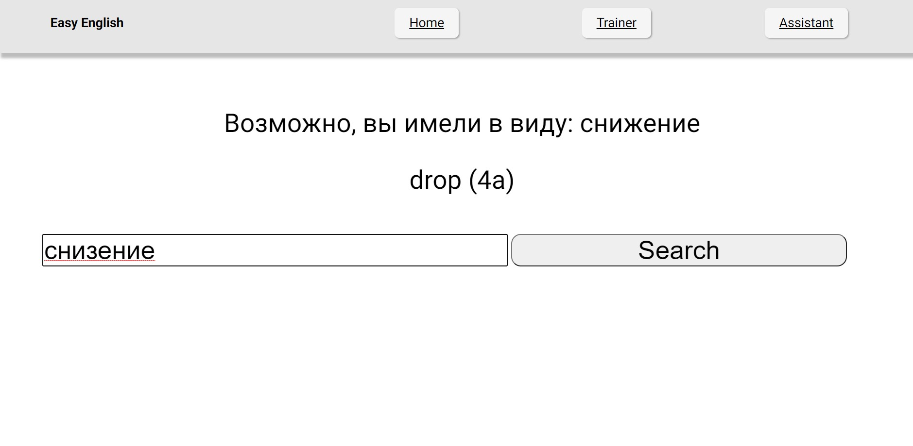

# Easy-English

## About

A web application written in Python using the Flask framework. This application helps students learn words from the dictionary and prepare for the test (by default, the words from the Spotlight 11 textbook are stored in the database, but you can add your own words)

There are 2 modes of operation:
 - Training in memorizing words
 - Assistant in translating words

In the first mode, you can select the module(s), the words from which you want to repeat and check yourself

In the second mode, you can enter words in Russian, and the application will output the found translation from different modules. At the same time, if you have made a typo in a word, the application will offer to correct the typo

## Run

 - You can download the project to your computer
 - Install the necessary libraries (run the `pip install -r requirements.txt` command in the terminal)
 - Move files from `./lang_package/` to `pathToPython/Lib/site-packages/enchant/share/enchant/myspell`
 - Launch the site locally (by default **http://127.0.0.1:5000/**)

## Site screenshots

